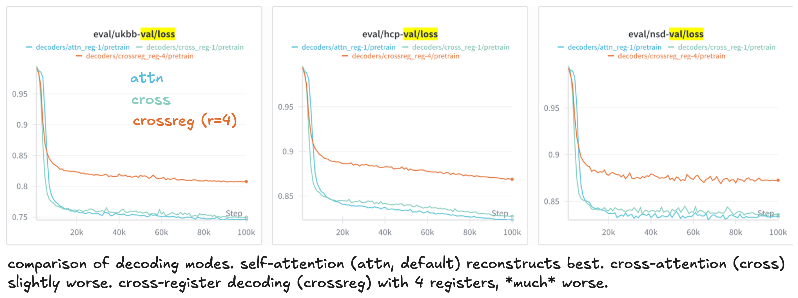
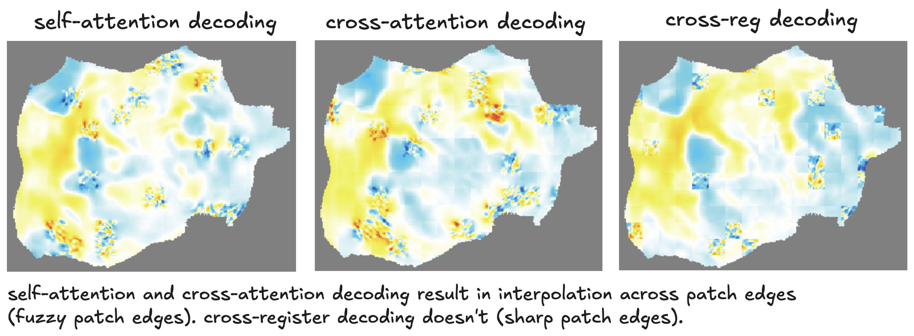
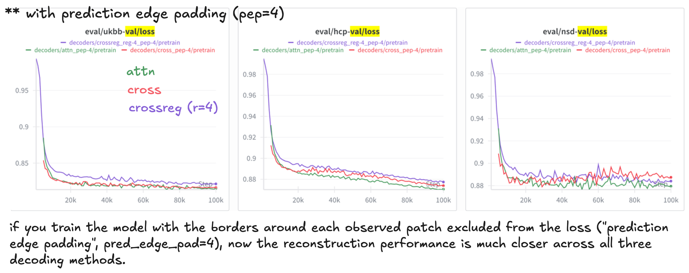
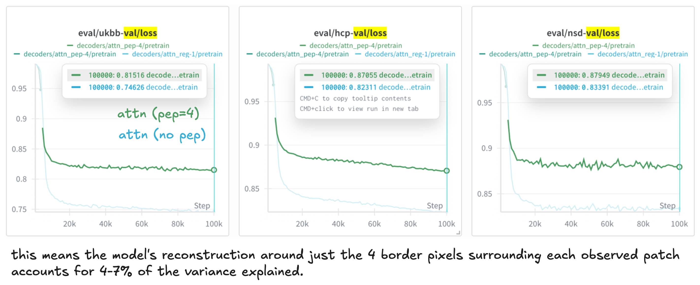
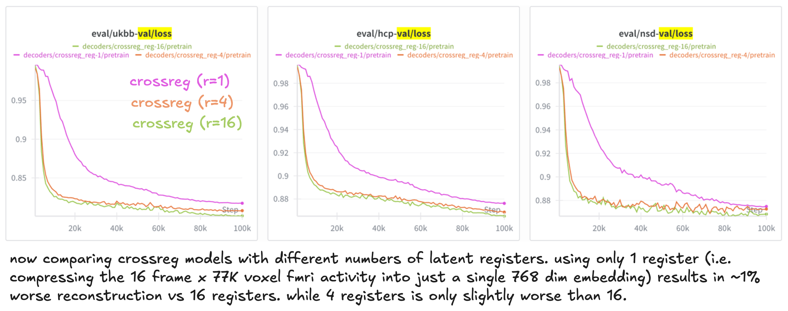

# Decoder ablation experiment

Decoding strategies:
- `attn`: standard self-attention decoding from original MAE.
- `cross`: cross-attention decoding from CrossMAE. decoder cross-attends to the embeddings for observed patches.
- `crossreg`: cross-register decoding. encoder compresses the input into a small number of latent register tokens. the decoding cross-attends to the registers only. the patch tokens are discarded.

### 1. cross-register decoding appears much worse

The initial pretrain run of all three decoding strategies showed the cross-register decoding performing much worse

### 2. local interpolation for self-attention decoding

On closer inspection, I noticed that both self-attention and cross-attention decoders show local interpolation effects across patch edges, while cross-register decoding doesn't.

### 3. preventing local interpolation closes the decoder gap

I retrained all three models with the border pixels around each observed patch excluded from the loss ("prediction edge padding", `pred_edge_pad` in the config, 4 pixels). This closed the gap between the different decoding methods (and also stopped the `attn` and `cross` decoding methods from locally interpolating.)

This means ~5% of the variance explained (out of total ~17%) is simply due to this local edge interpolation. quite a lot!

### 4. increasing number of registers doesn't improve reconstruction much

Last, I tried training multiple `crossreg` models with different number of latent registers. as expected, more registers (i.e. more capacity) improves reconstruction performance. but the gap between only 1 register and 16 registers is only ~1%. this means you can compress the 16 frame x 77K voxel fMRI activity down to just a single 768 dim embedding without losing much signal.

### Take-aways

- both cross-attention and cross-register decoding are competitive with standard self-attention decoding
- a significant fraction of masked reconstruction performance is driven by local interpolation
- you don't need many registers to reconstruct accurately

### Next-steps

- evaluate downstream performance
